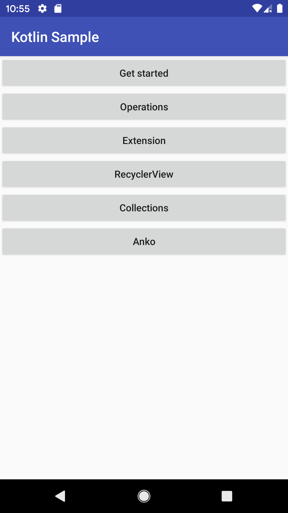

# Kotlin Sample

## 描述

Kotlin 的使用

## 屏幕截图

&nbsp;&nbsp;&nbsp;&nbsp;&nbsp;&nbsp;&nbsp;&nbsp;

## 结构

项目按照功能分包

* MainActivity ： 项目入口
    
    * getStarted kotlin 基本功能
    
    * operations kotlin 操作符
    
    * extension kotlin 扩展特性
    
    * recyclerView kotlin 版 RecyclerView 例子

## Bug 反馈

如果您有任何反馈或建议，欢迎提交到 [Github issues](https://github.com/OpenKotlin/KotlinSample/issues).

## LICENSE

    Copyright (c) 2019-present, Alpinist Wang Contributors.

    Licensed under the Apache License, Version 2.0 (the "License");
    you may not use this file except in compliance with the License.
    You may obtain a copy of the License at

    http://www.apache.org/licenses/LICENSE-2.0

    Unless required by applicable law or agreed to in writing, software
    distributed under the License is distributed on an "AS IS" BASIS,
    WITHOUT WARRANTIES OR CONDITIONS OF ANY KIND, either express or implied.
    See the License for the specific language governing permissions and
    limitations under the License.